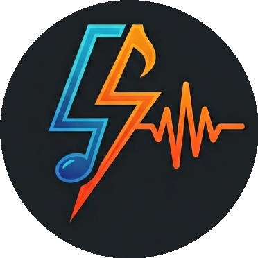
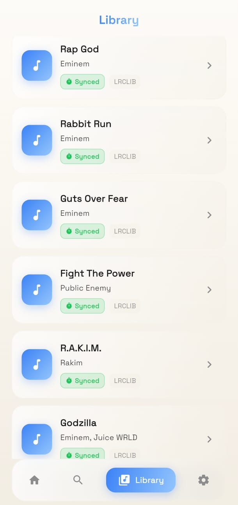
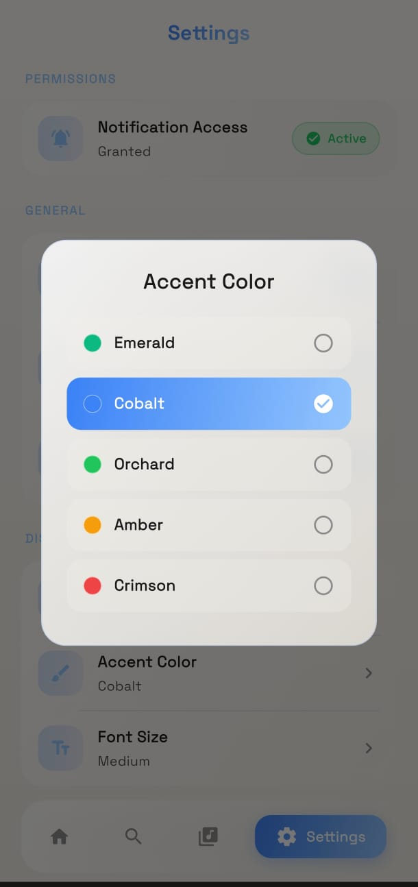

  

# FlashLyrics

Android app that detects what song you're playing and shows the lyrics. Works with Spotify, YouTube Music, Apple Music, JioSaavn, Gaana, SoundCloud, and pretty much any music app.

## Download

Grab the latest APK from [Releases](https://github.com/Avaneesh-Inamdar/FlashLyrics/releases).

## Features

### 🎵 Auto-detect & Synced Lyrics

Automatically detects the currently playing song using Android's MediaSession and shows synced lyrics that scroll in real time. Falls back to plain lyrics if synced aren't available. Pulls from 6 sources in parallel — so it's fast.

  

### 🔍 Manual Search

Can't find a song automatically? Search for any song by title or artist and get lyrics instantly.

  

### 🌗 Light & Dark Mode

Fully supports light and dark themes so it looks great no matter your preference.

  

### 🎨 Accent Color Customization

Personalize the app with your choice of accent colors to match your style.

  

### More

- Pulls lyrics from **6 different sources** — LRCLIB, Textyl, ChartLyrics, Lyrics.ovh, Lyrist, NetEase
- **Offline cache** — lyrics you've seen before load instantly
- **Share lyrics** as a styled image or plain text
- **Album art** pulled from the playing app
- Works with **Hindi, Japanese, Korean, Chinese** songs (NetEase covers Asian music well)

## Supported music apps

Spotify, YouTube Music, Apple Music, Amazon Music, SoundCloud, Deezer, Tidal, JioSaavn, Gaana, Wynk Music, Hungama, Resso, Musixmatch, Samsung Music, Mi Music, PowerAmp, VLC, Foobar, and 40+ more. If the app exposes a MediaSession, FlashLyrics will probably pick it up.

## Permissions

- **Notification Access** — required to detect what's playing. The app reads media notifications to get song title/artist. That's it.

## Lyrics sources

| Source | Type | Coverage |
|--------|------|----------|
| LRCLIB | Synced (LRC) | Best for timed lyrics |
| Textyl | Synced (LRC) | Good backup for synced |
| ChartLyrics | Plain | Large English catalog |
| Lyrics.ovh | Plain | Reliable fallback |
| Lyrist | Plain | Additional backup |
| NetEase | Plain | Strong for Asian music |

All sources are free and don't require API keys.

## License

This project is for personal/educational use.