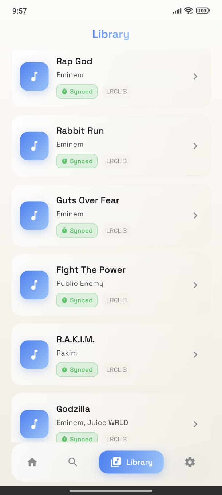

  

# FlashLyrics

Android app that detects what song you're playing and shows the lyrics. Works with Spotify, YouTube Music, Apple Music, JioSaavn, Gaana, SoundCloud, and pretty much any music app.

## Download

Grab the latest APK from [Releases](https://github.com/Avaneesh-Inamdar/FlashLyrics/releases).

## Screenshots

  
  &nbsp;&nbsp;
  
  &nbsp;&nbsp;
  
  &nbsp;&nbsp;
  

## What it does

- Detects the currently playing song automatically (uses Android's MediaSession + NotificationListener)
- Shows synced lyrics that scroll with the song (when available)
- Falls back to plain lyrics if synced aren't found
- Pulls lyrics from 6 different sources — LRCLIB, Textyl, ChartLyrics, Lyrics.ovh, Lyrist, NetEase
- All sources are hit in parallel so it's fast
- Manual search if auto-detection doesn't pick something up
- Offline cache — lyrics you've seen before load instantly
- Share lyrics as a styled image or plain text
- Album art from the playing app
- Works with Hindi, Japanese, Korean, Chinese songs (NetEase covers Asian music well)

## Supported music apps

Spotify, YouTube Music, Apple Music, Amazon Music, SoundCloud, Deezer, Tidal, JioSaavn, Gaana, Wynk Music, Hungama, Resso, Musixmatch, Samsung Music, Mi Music, PowerAmp, VLC, Foobar, and 40+ more. If the app exposes a MediaSession, FlashLyrics will probably pick it up.

## Permissions

- **Notification Access** — required to detect what's playing. The app reads media notifications to get song title/artist. That's it.

## Lyrics sources

| Source | Type | Coverage |
|--------|------|----------|
| LRCLIB | Synced (LRC) | Best for timed lyrics |
| Textyl | Synced (LRC) | Good backup for synced |
| ChartLyrics | Plain | Large English catalog |
| Lyrics.ovh | Plain | Reliable fallback |
| Lyrist | Plain | Additional backup |
| NetEase | Plain | Strong for Asian music |

All sources are free and don't require API keys.

## License

This project is for personal/educational use.