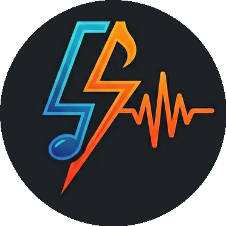
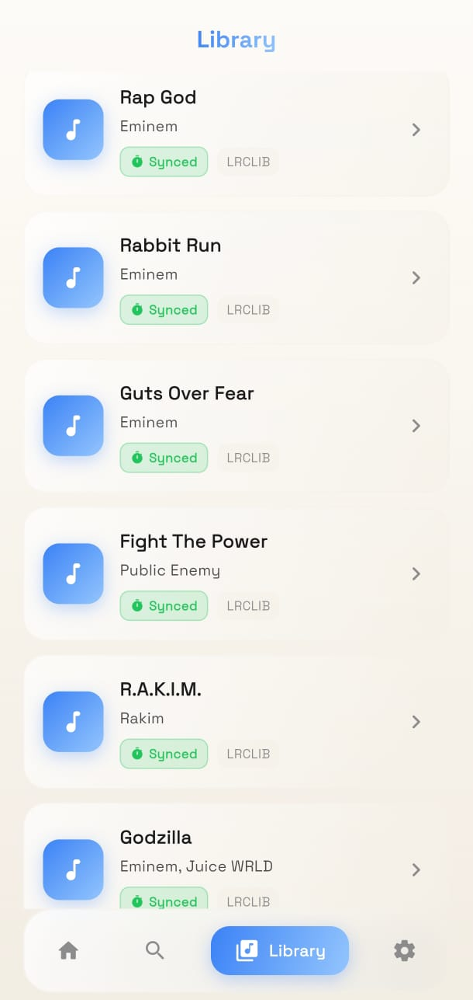
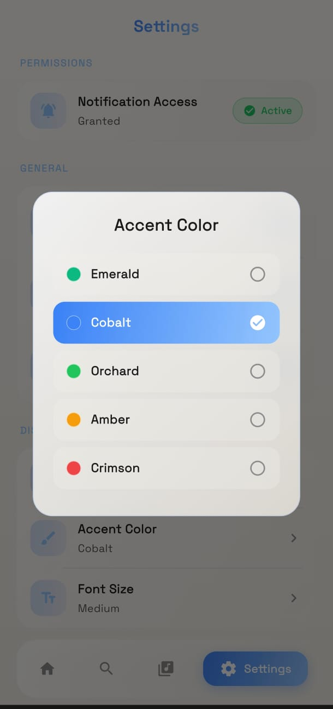

  

# FlashLyrics

> **Google Play Alpha Testing**: The new Play Store testing version is currently in alpha launch. Anyone willing to try may email me at [avaneesh.inamdar@gmail.com](mailto:avaneesh.inamdar@gmail.com).

Android app that detects what song you're playing and shows the lyrics. Works with Spotify, YouTube Music, Apple Music, JioSaavn, Gaana, SoundCloud, and pretty much any music app.

  
  &nbsp;&nbsp;
  

## Download

**v1.3.0 Coming Soon!**

A brand new version of **FlashLyrics (v1.3.0)** will be available in **2–3 days**, both on [GitHub Releases](https://github.com/Avaneesh-Inamdar/FlashLyrics/releases) and directly on the **Google Play Store**!

> **Important Note for Existing Users (v1.2.0 or earlier)**:
> When v1.3.0 launches, please make sure to **uninstall your existing version first** before installing, as FlashLyrics is transitioning to the Google Play Store with an official release signing key. Attempting to install over v1.2 directly will cause a signature mismatch ("App not installed") error.

## What's New in v1.3.0

- **Floating Lyrics Overlay Window**: Always-on-top lyrics widget over Spotify, YouTube Music, Apple Music, and more with real-time scrolling, tap-to-seek, and fluid multidirectional resizing.
- **Instant Skeleton Loading**: Smooth skeleton transition effect in the floating overlay as soon as tracks switch.
- **Now Playing Media Notification**: Persistent notification keeping track info accessible with a 1-tap "Float" button to summon the floating lyrics instantly without opening the full app.
- **Performance Optimization**: Eliminated frame drops and main-thread rebuilds for smooth 120Hz scrolling and fast app switching.
- **Smart Share Navigation**: Opening lyric sharing automatically highlights and scrolls straight to the currently playing line, with centered formatting and album cover art included.
- **Buy Me a Coffee Support**: Direct developer support integration in Settings.
- **Ad-Supported with Toggle**: Non-intrusive banner ads with a one-click toggle in Settings to turn off anytime.
- **Google Play Store Preparation**: Full compatibility and updated signing keys for Google Play release.

## Features

### Light & Dark Mode

Fully supports light and dark themes so it looks great no matter your preference.

  

### Offline Library

All lyrics you've viewed are cached locally. Access your entire library offline — instantly.

  

### Manual Search

Can't find a song automatically? Search for any song by title or artist and get lyrics instantly.

  

### Accent Color Customization

Personalize the app with your choice of accent colors to match your style.

  

### Synced Lyrics with Tap-to-Seek

Real-time synced lyrics that scroll automatically with the music. Tap on any lyric line to jump to that part of the song - just like your favorite streaming apps!

### Song Controls

Control playback directly from the app with the built-in seek bar. Play, pause, and seek to any position in the song without switching apps.

### Lyrics Sync Offset

Adjust the lyrics timing if they appear too early or late. Perfect for songs with unusual timing or when the sync is slightly off.

### More

- **Auto-detects** the currently playing song using Android's MediaSession
- **Synced lyrics** that scroll in real time (falls back to plain lyrics)
- **Tap on lyrics** to seek to that position in the song
- **Playback controls** with seek bar for manual song navigation
- Pulls lyrics from **6 different sources** — LRCLIB, Textyl, ChartLyrics, Lyrics.ovh, Lyrist, NetEase
- **Share lyrics** as a styled image or plain text
- **Album art** pulled from the playing app
- Works with **Hindi, Japanese, Korean, Chinese** songs (NetEase covers Asian music well)

## Supported music apps

Spotify, YouTube Music, Apple Music, Amazon Music, SoundCloud, Deezer, Tidal, JioSaavn, Gaana, Wynk Music, Hungama, Resso, Musixmatch, Samsung Music, Mi Music, PowerAmp, VLC, Foobar, and 40+ more. If the app exposes a MediaSession, FlashLyrics will probably pick it up.

## Permissions

- **Notification Access** — required to detect what's playing. The app reads media notifications to get song title/artist. That's it.

## Lyrics sources

| Source | Type | Coverage |
|--------|------|----------|
| LRCLIB | Synced (LRC) | Best for timed lyrics |
| Textyl | Synced (LRC) | Good backup for synced |
| ChartLyrics | Plain | Large English catalog |
| Lyrics.ovh | Plain | Reliable fallback |
| Lyrist | Plain | Additional backup |
| NetEase | Plain | Strong for Asian music |

All sources are free and don't require API keys.
